# NEO4J INTRODUCTION

These are the query I used in a Neo4j course.

Each question has some queries with the result images.

# Querying basics
## 1. [Basics] Get a 2-level contact degrees

```SQL
MATCH (p1:Person)-[rela:HAS_CONTACT]->(p2:Person)
MATCH (p2:Person)-[rela2:HAS_CONTACT]->(p3:Person)
RETURN p1.name, p2.name, p3.name
LIMIT 1
```

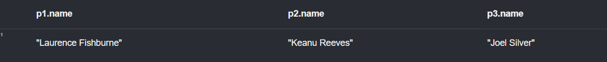

## 2. [Optional Matching] Get a list of people, each of whom has contact with another person who *may or may not* direct a movie. If they do direct one, get the movie name

```SQL
MATCH (p1:Person)-[:HAS_CONTACT]->(p2:Person)
optional MATCH (p2)-[:DIRECTED]->(movie:Movie)
RETURN p1.name, p2.name, movie.title
```

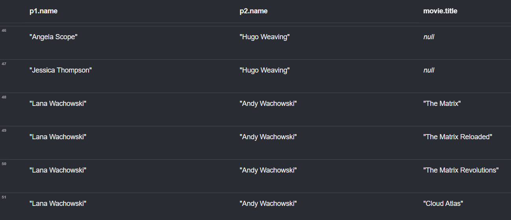

## 3. [Filtering] Get the person *named* Tom Hanks, *born* in 1956

```SQL
MATCH (tom:Person{name: 'Tom Hanks', born: 1956})
RETURN tom
```

### OR

```SQL
MATCH (tom:Person)
WHERE tom.name = 'Tom Hanks' AND tom.born = 1956
RETURN tom
```

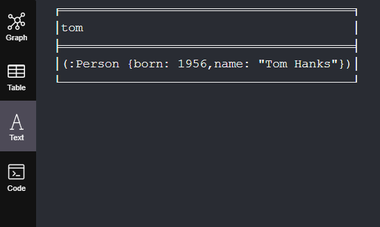

## 4. [Conditional Matching] Get a list of people each of whom has their *name starts with T* or later in the alphabet

```SQL
MATCH (someone:Person)
WHERE someone.name >= 'T'
RETURN someone
LIMIT 7
```

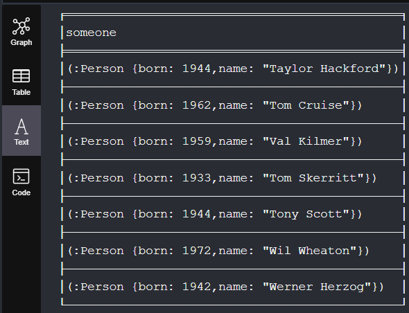

## 5. [AND, OR, NOT Operators] Get people *born* in the 50s and 60s

```SQL
MATCH (someone:Person)
WHERE
    someone.born >= 1950 AND
    someone.born < 1970
RETURN someone
```

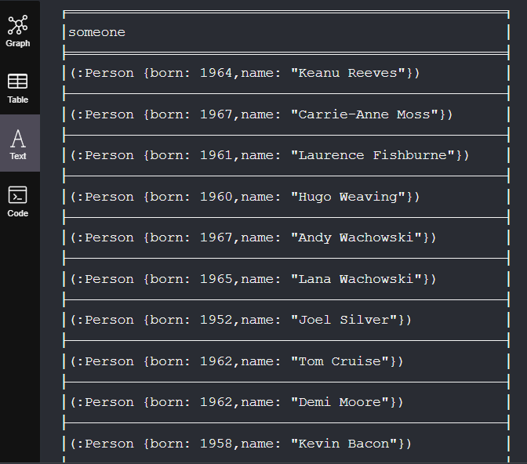

## 6. [Filtering on Paths] Get people who *did not direct* the movie Unforgiven but involve in it in *some way*

```SQL
MATCH (people:Person)-[]->(movie:Movie)
WHERE movie.title = 'Unforgiven' AND NOT (people)-[:DIRECTED]->(movie)
RETURN movie, people
```

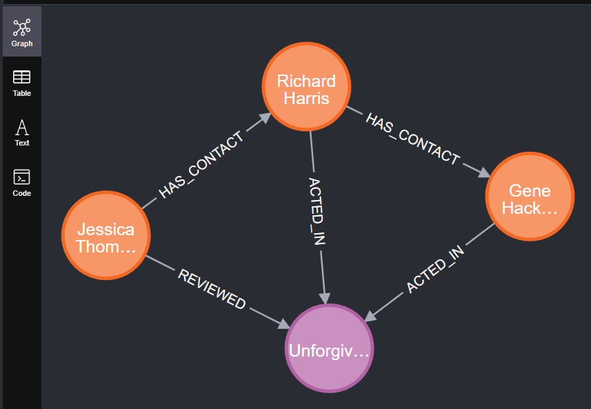

## 7. [RegEx] Movies that have 'The' (*not case sensitive*) *somewhere* in their name, not at the start

```SQL
MATCH (movie:Movie)
WHERE movie.title =~ '(?i).+The .*'
RETURN movie
```

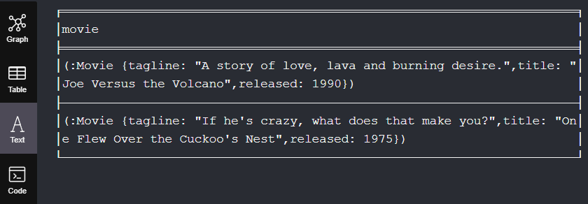

## 8. [ORDER BY, LIMIT, SKIP, AS] Get the 4th, 5th, 6th actors in the movie Top Gun in terms of *earnings*

```SQL
MATCH (actor:Person)-[role:ACTED_IN]->(movie:Movie)
WHERE movie.title = 'Top Gun'
RETURN actor.name AS Actors, role.earnings AS Earnings
ORDER BY Earnings DESC
SKIP 3
LIMIT 3
```

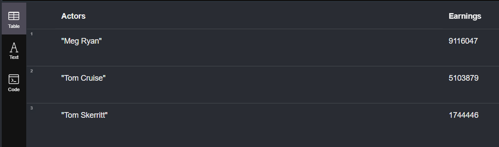

## 9. Get all Tom Hanks' actor contact who were born in 1960 or later, and have earned over 10 mils in a single movie. Return their name, birth year and earnings and order the result in highest earning first

```SQL
MATCH (tom:Person{name: 'Tom Hanks'})-[:HAS_CONTACT]->(rich_actor:Person)-[role:ACTED_IN]->(:Movie)
WHERE
    role.earnings > 10000000 AND
    rich_actor.born >= 1960
RETURN
    rich_actor.name AS `Contact Name`,
    rich_actor.born AS `Born`,
    role.earnings AS Earnings
ORDER BY Earnings DESC
```

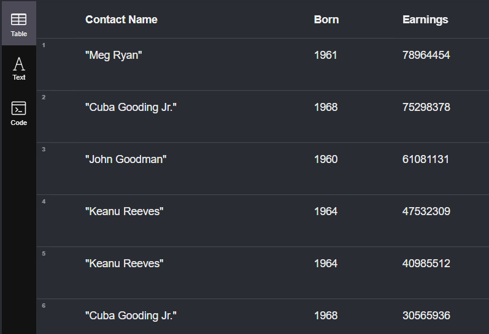

## 10. [DISTINCT] Get actors who earn more than 10 mils in any movie

```SQL
MATCH (actor:Person)-[role:ACTED_IN]->(movie:Movie)
WHERE role.earnings > 10000000
RETURN DISTINCT actor.name
```


## 11. [Aggregate Functions] Get actors and number of movies they acted in

```SQL
MATCH (actor:Person)-[:ACTED_IN]->(movie:Movie)
RETURN actor.name, COUNT(movie)
```

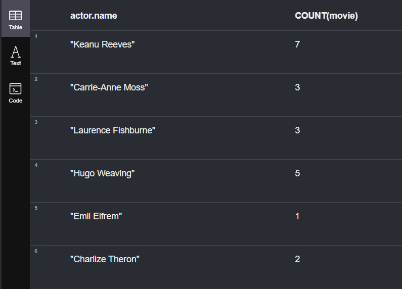

## 12. [String and Math Functions] Top 10 actors with highest avg earnings per movie. Round the earnings and actors' name should be in uppercase

```SQL
MATCH (actor:Person)-[role:ACTED_IN]->(movie:Movie)
RETURN UPPER(actor.name) AS Actor, ROUND(AVG(role.earnings), 2) AS `Average Earnings`
ORDER BY `Average Earnings` DESC
LIMIT 10
```

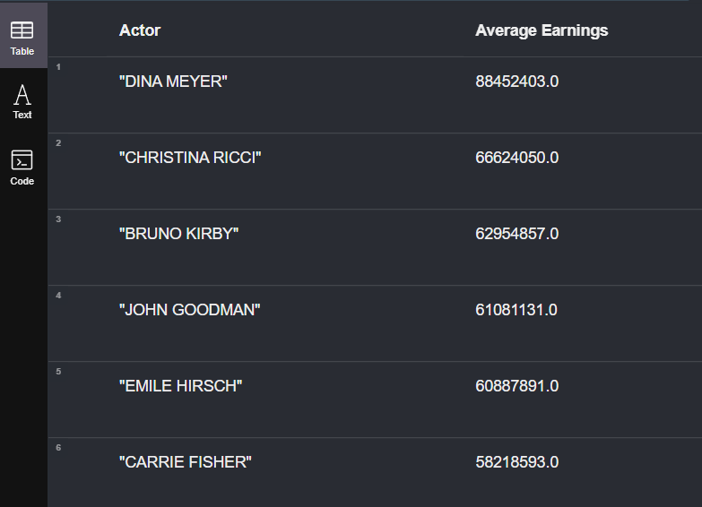

# Create, Merge, Delete and Update
## 1. [Create Node] Create a node `cat` of label `Cat` and `Animal`, sounds `meow` and eats `birds`

```SQL
CREATE (cat:Cat:Animal{sound: 'meow', eats: 'birds'})
RETURN cat
```

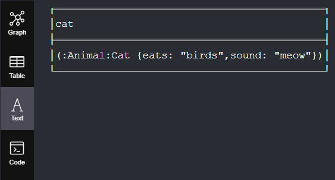

## 2. [Create Relationship] Create a node `cat` named `Fluffy`. It has a `GROOMS` relationship on its own daily

```SQL
CREATE (cat:Cat{name: 'Fluffy'})-[:GROOMS{period: 'Daily'}]->(cat)
```

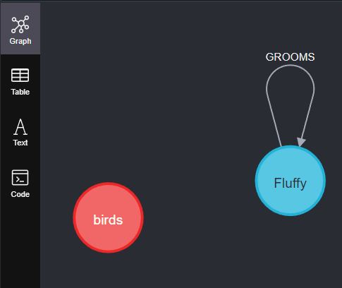

## 3. [Create with no repeating relationship] 2 bunnies likes each other and a fox who also like one of them

```SQL
MERGE (zoe:Bunny{name: 'Zoe Bunny'})
MERGE (julia:Bunny{name: 'Julia Bunny'})
MERGE (zoe)-[:LIKES]->(julia)
MERGE (zoe)<-[:LIKES]-(julia)
MERGE (roxy:Fox{name: 'Roxy Foxy'})-[:LIKES]->(zoe)
RETURN zoe, roxy, julia
```

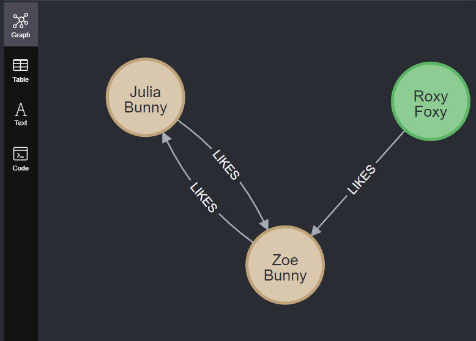

## 4. Add movie 'The Hateful Eight' by Quentin Tarantino

```SQL
MERGE (director:Person{name: 'Quentin Taratino'})-[:DIRECTED]->(movie:Movie{title: 'The Hateful Eight'})
RETURN director, movie
```

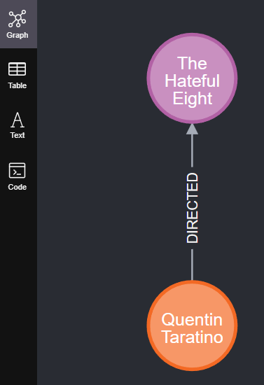

## 5. Quentin Tarantino has Zoe Bell as a contact. Zoe is a New Zealand actress who was born in 1978, earnt 1 mil from starring in The Hateful Eight. Add that info

```SQL
MERGE (zoe:Person{
    name: 'Zoe Bell', 
    born: 1978, 
    nation: 'New Zealand'}
    )-[:ACTED_IN{earnings: 1000000}]->(
    movie:Movie{title: 'The Hateful Eight'}
    )
MERGE (quentin:Person{name: 'Quentin Tarantino'})-[:HAS_CONTACT]->(zoe)
RETURN zoe, quentin, movie
```

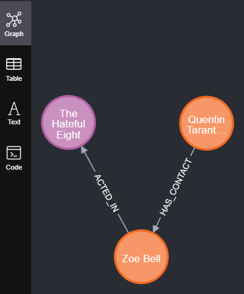

## 6. [Delete] Delete everything (nodes with rel can't be deleted with match - delete alone)

```SQL
MATCH (node)
OPTIONAL MATCH (node)-[rel]->()
DELETE node, rel
```

### OR

```SQL
MATCH (node)
DETACH DELETE node
```

## 7. Remove Tom Hanks from all contact list of fellow actors

```SQL
MATCH (tom:Person{name: 'Tom Hanks'})<-[rela:HAS_CONTACT]-(p1:Person)-[:ACTED_IN]->(:Movie)
DELETE rela
```

## 8. Remove The Da Vinci Code from the database

```SQL
MATCH (movie:Movie{title:'The Da Vinci Code'})
DETACH DELETE movie
```

## 9. [Update Relationship] Update Tom Hanks `HAS_CONTACT` relationship with Halle Berry to `OLD_CONTACT` that *still carry all properties over*

```SQL
MATCH (tom:Person{name: 'Tom Hanks'})-[ori_rel:HAS_CONTACT]->(halle:Person{name: 'Halle Berry'})
CREATE (tom)-[new_rel:OLD_CONTACT]->(halle)
SET new_rel = ori_rel
DELETE ori_rel
RETURN tom, halle
```

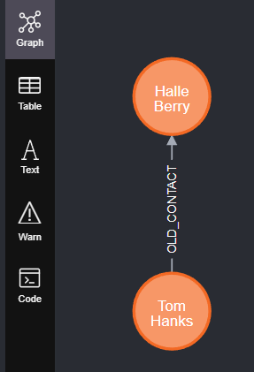

## 10. [Set with Dynamic Values] Find actors who earnt more than 50 mils and set their label to `Rich` and add a `total_earnings` property to them.

```SQL
MATCH (actor:Person)-[role:ACTED_IN]->(movie:Movie)
WITH actor, sum(role.earnings) AS total_earnings  -- WITH is necessary to set dynamic values
WHERE total_earnings > 50000000
SET actor.total_earnings = total_earnings
SET actor:Rich
RETURN actor
```

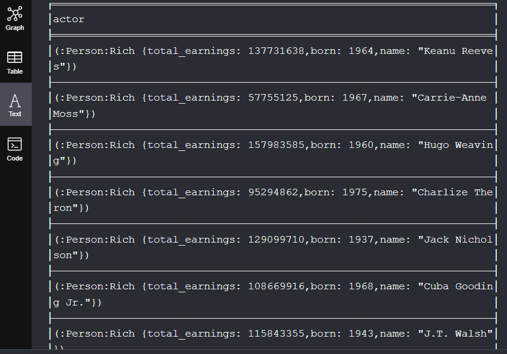

## 11. [Delete Label and Properties] Revert the changes above

```SQL
MATCH (actor:Rich)
REMOVE actor:Rich, actor.total_earnings
RETURN actor
```

## 12. [ON CREATE/MATCH SET] Create a view relationship between Keanu and Top Gun, count how many times Keanu viewed the movie

```SQL
MERGE (keanu:Person{name: 'Keanu Reeves'})-[view:VIEWED]->(movie:Movie{title: 'Top Gun'})
ON CREATE SET view.count = 1
ON MATCH SET view.count = view.count + 1
RETURN keanu, view, movie
```

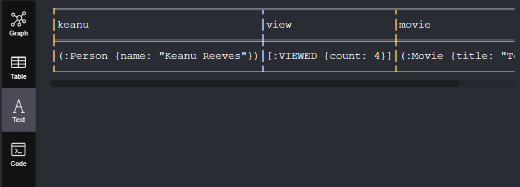

# Working with Paths
## 1. [Nth Degree relationships] Find 3rd degree contacts of Keanu Reeves

```SQL
MATCH path=(keanu:Person{name: 'Keanu Reeves'})-[:HAS_CONTACT*3]->(:Person)
RETURN path
LIMIT 10
```


## 2. [Variable Path length] Find 2nd and 3rd degree contacts of Keanu Reeves

```SQL
MATCH path=(keanu:Person{name: 'Keanu Reeves'})-[rel:HAS_CONTACT*2..3]->(others:Person)
RETURN keanu, rel, others
LIMIT 10
```


## 3. [Shortest Paths] Find all shortest paths from Keanu Reeves to Tom Cruise in terms of Contacts

```SQL
MATCH (keanu:Person{name: 'Keanu Reeves'})
MATCH (tom:Person{name: 'Tom Cruise'})
MATCH paths = allShortestPaths((keanu)-[:HAS_CONTACT*..10]->(tom))
RETURN paths, length(paths)RETURN path
LIMIT 10
```

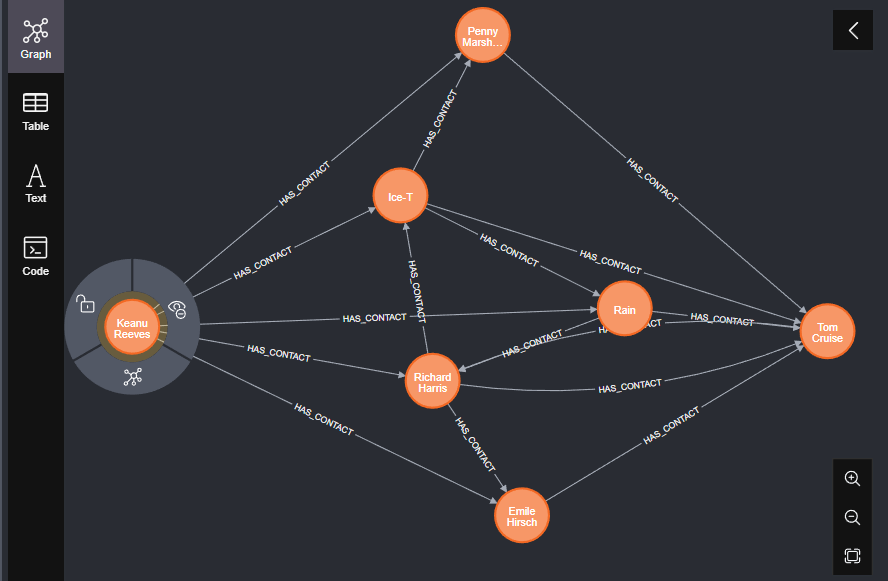

## 4. Find tha shortest path between actors that acted in The Matrix and other actors that acted in Top Gun. 3 results limitation

```SQL
MATCH (matrix_acts:Person)-[:ACTED_IN]->(:Movie{title: 'The Matrix'})
MATCH (top_gun_acts:Person)-[:ACTED_IN]->(:Movie{title: 'Top Gun'})
MATCH paths = AllShortestPaths((matrix_acts)-[*..10]->(top_gun_acts))
WHERE matrix_acts <> top_gun_acts
RETURN paths, length(paths) as path_length
ORDER BY path_length
LIMIT 3
```

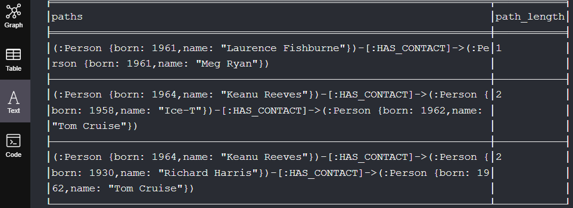